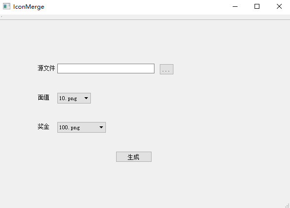

# 图片合成，添加角标

;

使用环境: Qt5.7.1 + Visual Studio 2013 + openCV3.0

## 功能

为原图添加角标，也可以认为是水印

原图

输出图

## 详细

- [award](./IconMerge/award/) 和 [price](./IconMerge/price/) 目录分别存储面值和奖金对应的 Icon, 可以在不修改代码的前提下，添加图片以增加种类。
- 输出文件在源文件同目录下增加前缀 `de_`。

## openCV

openCV 版本是 3.0, 引用配置文件是 `opencd.props` 和 `opencv.props` 分别对应 debug 和 release 环境。可以在 VS2013 的 **视图->其他窗口->属性管理器** 中添加，里面包含了本地的 openCV 头文件，原则上可以替换为更高级版本，但是需要替换 `opencv_world300.dll` 和 `opencv_world300d.dll`。如果输出 Release 包，也需要手动拷贝这两个 dll 到 Release 包内。

## 不足

1. 没有判断是否源文件、输出文件、角标文件，是否存在，是否为图片，存在 crash 情况。
   